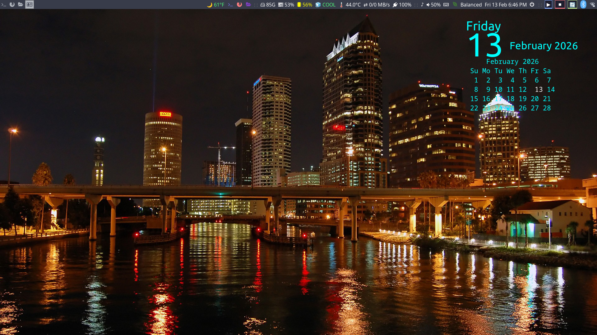
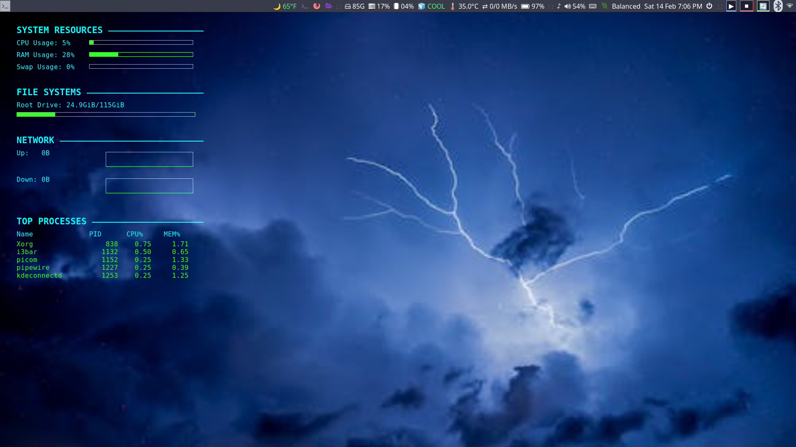
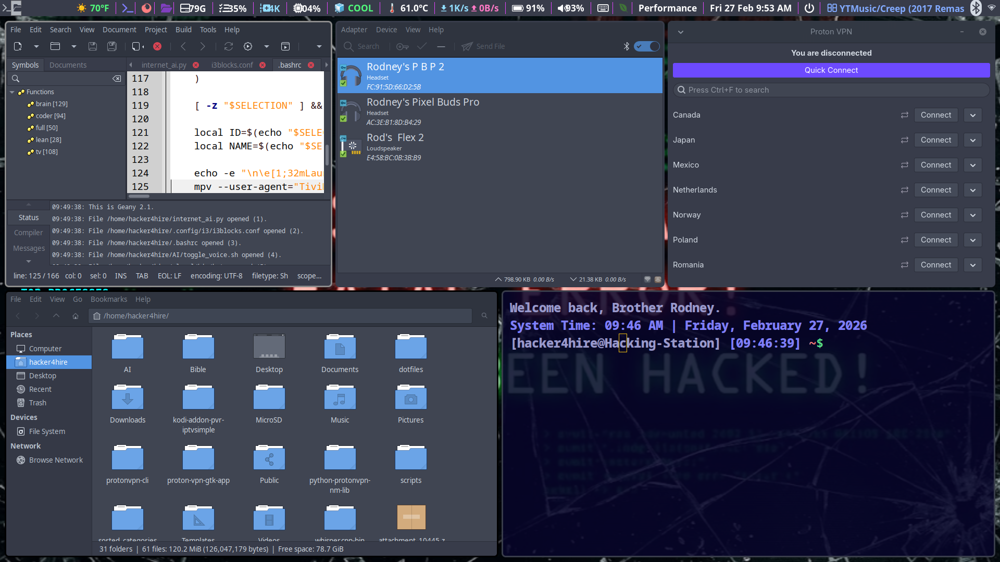
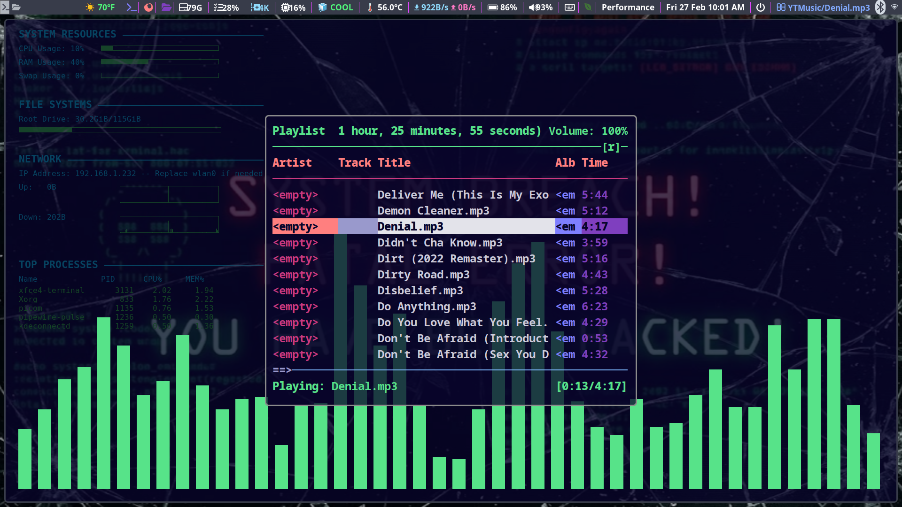
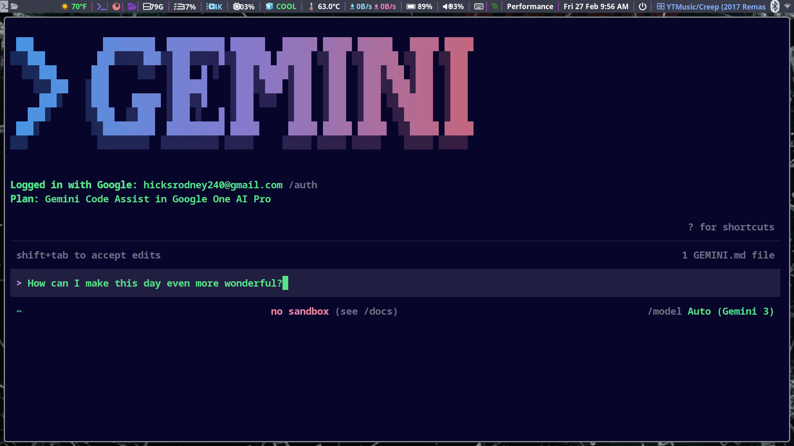
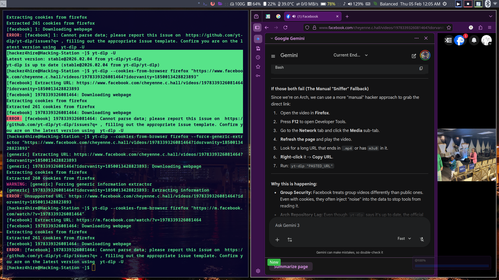

# 💻 Arch / i3 Hacking Station Dotfiles

Welcome to the **Hacking Station** configuration repository. This is a highly optimized, lean, and mean dotfiles setup tailored for an EndeavourOS / Arch Linux environment running the i3 window manager with 4GB of RAM.

## 🖼️ Screenshots

|  |  |
|:---:|:---:|
|  |  |
|  |  |

## 🚀 Features

- **Blazing Fast i3 setup** tailored for performance.
- **AI Integration built-in** with custom bash functions (`brain`, `coder`) leveraging local models via Ollama.
- **Custom Rofi Menus** for system management and quick access to configurations.
- **Advanced bash profiling** with memory management utilities (`lean`, `full`, `turbo`, `cool`).
- **Media and IPTV integrations** built straight into the terminal.

## 🛠️ Installation

**Warning:** This script will backup any existing conflicting files into a timestamped directory (e.g., `~/.dotfiles_backup_YYYYMMDD_HHMMSS`) before creating symlinks to this repository.

1. Clone this repository into your home directory:
   ```bash
   git clone https://github.com/Hacker4Hire-sudo/sturdy-enigma-EOS-i3.git ~/dotfiles
   ```
2. Navigate to the directory:
   ```bash
   cd ~/dotfiles
   ```
3. Run the installation script:
   ```bash
   chmod +x install.sh
   ./install.sh
   ```

## 📂 Structure

- `AI/` - Local AI integration scripts for system management and interaction.
- `.config/i3/` - i3 window manager configurations and keybindings.
- `.config/rofi/` - Customized rofi themes and scripts.
- `.config/picom/` - Compositor configurations for performance.
- `.local/bin/` - Custom shell scripts and CLI utilities.
- `scripts/` - Additional user scripts, including the `config_launcher.sh` which serves as a unified control center for modifying these very dotfiles.

## 🎛️ Config Launcher

This dotfiles repository comes with a powerful `config_launcher.sh` script that allows you to easily edit your configuration files and scripts directly from a rofi menu.

Simply run:
```bash
~/scripts/config_launcher.sh
```
Or bind it to a key in your i3 config!

---
*Optimized for speed and efficiency.*
